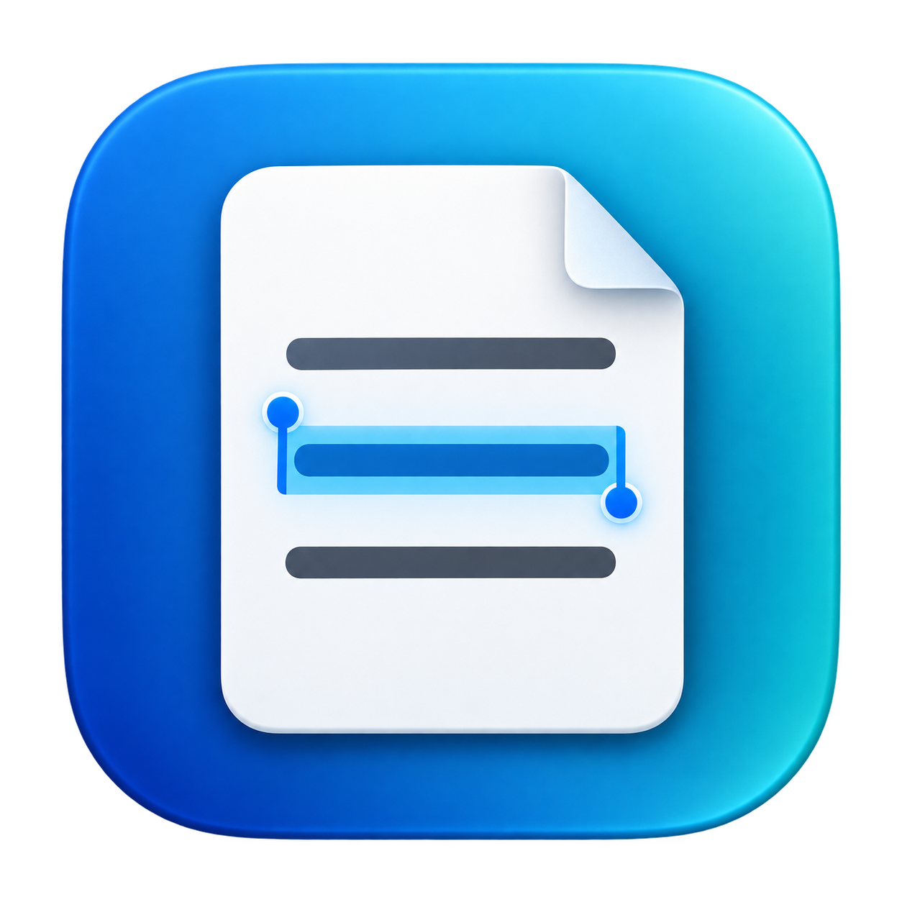

# PDFCopy



A native macOS prototype for opening PDFs, selecting text, and copying it elsewhere. OCR runs locally with Apple Vision. SwiftUI and PDFKit provide the interface and native text selection.

## Run

Requires macOS 14+ and Xcode with Swift 5.9+.

```sh
git clone https://github.com/jasontitus/pdfcopy.git
cd pdfcopy
bash scripts/build-app.sh
open dist/PDFCopy.app
```

Or open `Package.swift` in Xcode and run the PDFCopy executable scheme. `swift run PDFCopy /absolute/path/to/document.pdf` also works.

Open or drop a PDF. Existing text is selectable immediately. OCR adds selectable text to scans and image regions in the background, starting with the visible page. Double-click a word, drag a selection, then press Command-C or use the Copy button. Use **Recognize Again** on a page whose embedded text copies incorrectly. Recognition never overwrites your PDF. It is recomputed when you reopen the file.

The local app bundle is ad-hoc signed for development, not notarized for distribution. It contains no third-party dependencies or network code. Text copied to the system clipboard is handled by macOS and the user's clipboard settings.

This is an early macOS prototype. The iOS interface is not implemented yet. Read the [privacy notes](PRIVACY.md), [roadmap](PLAN.md), and [known limitations](VALIDATION.md) before testing important documents.

## Install on your Mac

1. Build the app using the commands above. Xcode is needed to build; it is not needed just to run an already-built app.
2. Quit PDFCopy if it is running.
3. In Finder, open the project's `dist` folder and drag **PDFCopy.app** into **Applications**. If updating, replace the previous copy when prompted.
4. Launch **PDFCopy** from Applications or Spotlight. Open a PDF with **Command-O**, select text, and press **Command-C** to copy it.

The bundle includes its app icon and runs on macOS 14 or later. The build script produces a local, ad-hoc-signed app for the build machine's architecture; this is not a notarized download or a universal Mac release. Future updates currently require rebuilding and replacing the app.

The icon's source artwork and generation prompt are described in [Assets/README.md](Assets/README.md). The build generates all macOS icon sizes automatically with the system's `sips` and `iconutil` tools.

## Try a synthetic sample

After building the app, generate a three-page sample containing native text, scanned text, and mixed content:

```sh
swift scripts/make-sample.swift
open -a "$PWD/dist/PDFCopy.app" "$PWD/dist/Sample.pdf"
```

No real documents are bundled in this repository.

## Test

```sh
CLANG_MODULE_CACHE_PATH="$PWD/.build/clang-cache" \
SWIFTPM_MODULECACHE_OVERRIDE="$PWD/.build/module-cache" \
swift test --disable-sandbox
```

Tests exercise actual Vision OCR on generated scans, mixed native/scanned content, duplicate suppression, invisible-text selection, unchanged page appearance, rotated/cropped geometry, and forced text replacement. An app-level regression test covers background OCR, live document refresh, deferred updates during selection, and accessibility traversal. See [PLAN.md](PLAN.md) for scope, later phases, and remaining release validation.

## Structure

- `PDFCopyCore`: render/recognize/compose pipeline and replaceable `TextRecognizer` interface.
- `PDFCopy`: Mac app, background scheduling, file opening, password prompt, and native PDF view.
- `Tests`: generated PDF fixtures and OCR/selection integration tests.

The initial OCR engine has been evaluated on eight pages from two user-supplied PDFs; see `VALIDATION.md`. It has not been benchmarked against MinerU. Isolated list numbers, handwriting, complex reading order, and languages outside Vision's support need further work. Search, image copying, the iOS interface, and local PDF questions are not implemented yet.

To run the optional real-document tests, set `PDFCOPY_TEST_DOCUMENTS` to a local folder when running `swift test`. Rendered comparisons, extracted text, and metrics stay under the ignored `.build/validation` directory; private document contents are not included in the source tree.

See [CONTRIBUTING.md](CONTRIBUTING.md) for development and bug-report guidance.
